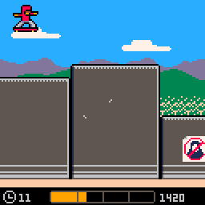

# sk8border



(Le français suit)

Lay that wall to waste! [#antifagamejam](https://twitter.com/search?q=%23antifagamejam)

Sk8Border was created in Montreal in March/April 2018 for the Anti-Fascist Game Jam (https://itch.io/jam/antifa-game-jam) as a collaborative effort by Leif Halldór Ásgeirsson, Marc-André Toupin and Ben Wiley. It is built with PICO-8 (https://www.lexaloffle.com/pico-8.php).

This game runs in your web browser - even on your phone!

----------------------

Fracassez la frontière! [#antifagamejam](https://twitter.com/search?q=%23antifagamejam)

Sk8Border a été créé à Montréal en mars/avril 2018 pour le Anti-Fascist Game Jam (https://itch.io/jam/antifa-game-jam), par Leif Halldór Ásgeirsson, Marc-André Toupin et Ben Wiley. Il est fait avec PICO-8 (https://www.lexaloffle.com/pico-8.php).

Ce jeu fonctionne dans le navigateur - même sur les téléphones!

## Play / jouer

Current build is playable online at: https://sk8border.github.io/sk8border/

Binaries for Linux, Windows and Mac are available on the Itch.io: https://sk8border.itch.io/sk8border

## exportation

### Check out the build branch

Checkout `gh-pages`

```console
git checkout gh-pages
git merge master
```

### Standard build (won't work currently)

Create a new web build from PICO-8 with:

```console
export index.js
```

### Minified build (because we have too much code!)

0. Make sure you have python3 installed on your OS
1. Download [picotool](https://github.com/dansanderson/picotool)
2. Generate a lua-minified version of our p8 file:
  ```console
  /path/to/picotool/p8tool luamin ./sk8border.p8
  ```
3. Now we'll have a new file called `sk8border_fmt.p8`. Don't save this, but we'll load it in PICO-8!
4. Inside of PICO-8 run:
  ```console
  load sk8border_fmt.p8
  export index.js
  load sk8border.p8
  ```
5. Delete the minified file: `rm sk8border_fmt.p8`

### Finish up

Push:

```console
git push origin gh-pages
```

Back to master:

```console
git checkout master
```

## html

If you need to update the html content in the `web_template` directory, you can build the html pages by:

0. Install Node.js
1. Run `npm install` in the project directory
2. `npm run build`

## traduction

If you need to update any game text translations, they're kept in the [`game_translations/`](/game_translations) directory. In order for your changes to show up in the game, you'll need to run [`./update_translation`](/update_translation), which will update `sk8border.p8` automatically, using a compiled string format to save tokens. This requires [Lua](https://www.lua.org/start.html) to be installed on your system (this version doesn't ship with PICO-8 so you would need to install it separately).

If you want to add a new language, just copy an existing translation file and modify it. When you're done, update the boilerplate in [`./update_translation`](/update_translation) to make sure it gets included in the updated p8 file.
